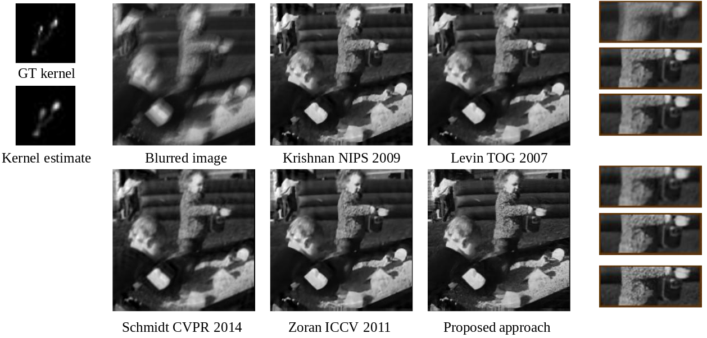
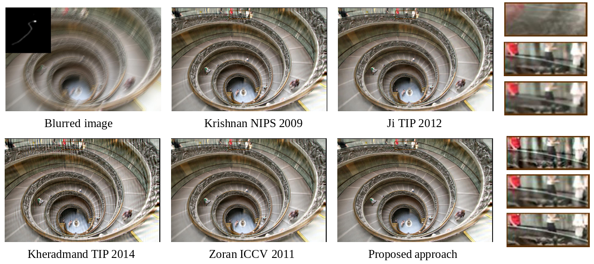
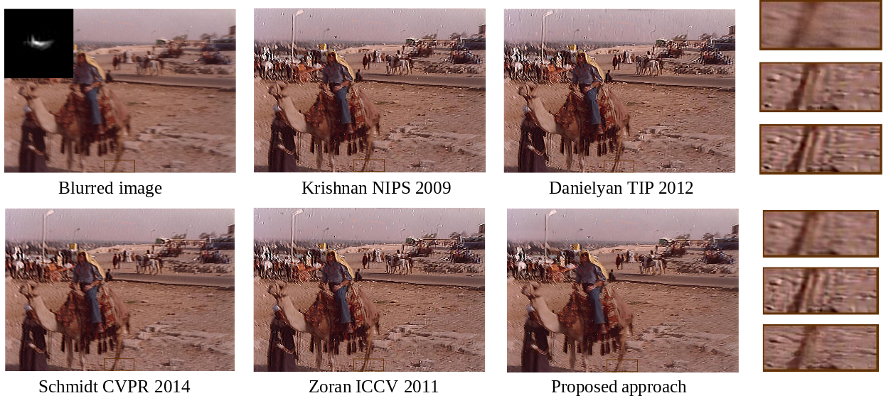

# Handling Kernel Uncertainty with CNNs [paper](https://drive.google.com/file/d/1htYVSTXJ60ChPUWjsCHblS22IWlwMitX/view)

This repo provides the test code, pretrained models, and results on benchmark datasets of our CVPR 2018 paper ([Non-blind Deblurring: Handling Kernel Uncertainty with CNNs](https://drive.google.com/file/d/1htYVSTXJ60ChPUWjsCHblS22IWlwMitX/view)).

"Non-blind Deblurring: Handling Kernel Uncertainty with CNNs", [Subeesh Vasu](https://subeeshvasu.github.io), Venkatesh Maligireddy and [A. N. Rajagopalan](http://www.ee.iitm.ac.in/~raju/), IEEE Conference on Computer Vision and Pattern Recognition (CVPR 2018), Salt Lake City, USA, June 2018.

#### BibTeX

 
     @inproceedings{vasu2018non,
        author = {Vasu, Subeesh and Reddy Maligireddy, Venkatesh and Rajagopalan, AN},
        title = {Non-Blind Deblurring: Handling Kernel Uncertainty With CNNs},
        booktitle = {Proceedings of the IEEE Conference on Computer Vision and Pattern Recognition},
        pages={3272--3281},
        year = {2018}}
## Results     

Visual comparison for NBD from inaccurate kernel estimates on [Levin CVPR 2011](http://webee.technion.ac.il/people/anat.levin/papers/deconvLevinEtalCVPR11.pdf) and [Lai CVPR 2016](http://vllab.ucmerced.edu/wlai24/cvpr16_deblur_study/) datasets. [Levin TOG 2007](https://groups.csail.mit.edu/graphics/CodedAperture/), [Krishnan NIPS 2009](https://dilipkay.wordpress.com/fast-deconvolution/), [Zoran ICCV 2011](https://people.csail.mit.edu/danielzoran/EPLLICCVCameraReady.pdf), [Danielyan TIP 2012](https://www.cs.tut.fi/~foi/GCF-BM3D/BM3DframesDeblur-Danielyan.pdf), [Ji TIP 2012](http://www.math.nus.edu.sg/~matjh/download/robust_deblur/TIP_2012_deblur.pdf), [Kheradmand TIP 2014](https://ieeexplore.ieee.org/document/6918453/), and [Schmidt CVPR 2014](http://research.uweschmidt.org/pubs/cvpr14schmidt.pdf) are existing works on NBD.

## Results on public benchmark datasets

- [Levin CVPR 2011]()
- [Sun ICCP 2013]() 
- [Lai CVPR 2016]()

## References

[Levin TOG 2007] A. Levin, R. Fergus, F. Durand, and W. T. Freeman.: [Image and depth from a conventional camera with a coded aperture](https://groups.csail.mit.edu/graphics/CodedAperture/). TOG 2007

[Krishnan NIPS 2009] D. Krishnan and R. Fergus. [Fast image deconvolution using hyper-laplacian priors](https://dilipkay.wordpress.com/fast-deconvolution/). NIPS 2009.

[Zoran ICCV 2011] D. Zoran and Y. Weiss.: [From learning models of natural image patches to whole image restoration](https://people.csail.mit.edu/danielzoran/EPLLICCVCameraReady.pdf), ICCV 2011

[Levin CVPR 2011] A. Levin, Y. Weiss, F. Durand, and W. T. Freeman.: [Efficient marginal likelihood optimization in blind deconvolution](http://webee.technion.ac.il/people/anat.levin/papers/deconvLevinEtalCVPR11.pdf). CVPR 2011

[Danielyan TIP 2012] A. Danielyan, V. Katkovnik, and K. Egiazarian.: [Bm3d frames and variational image deblurring](https://www.cs.tut.fi/~foi/GCF-BM3D/BM3DframesDeblur-Danielyan.pdf), TIP 2012

[Ji TIP 2012] H. Ji and K. Wang.: [Robust image deblurring with an inaccurate blur kernel](http://www.math.nus.edu.sg/~matjh/download/robust_deblur/TIP_2012_deblur.pdf), TIP 2012

[Sun ICCP 2013] L. Sun, S. Cho, J. Wang, and J. Hays.: [Edge-based blur kernel estimation using patch priors](http://cs.brown.edu/~lbsun/deblur2013/deblur2013iccp.html). ICCP 2013

[Kheradmand TIP 2014] A. Kheradmand and P. Milanfar.: [A general framework for regularized, similarity-based image restoration](https://ieeexplore.ieee.org/document/6918453/). TIP 2014

[Schmidt CVPR 2014] U. Schmidt and S. Roth.: [Shrinkage fields for effective image restoration](http://research.uweschmidt.org/pubs/cvpr14schmidt.pdf). CVPR 2014

[Lai CVPR 2016] W.-S. Lai, J.-B. Huang, Z. Hu, N. Ahuja, and M.-H. Yang.: [A comparative study for single image blind deblurring](http://vllab.ucmerced.edu/wlai24/cvpr16_deblur_study/). CVPR 2016

